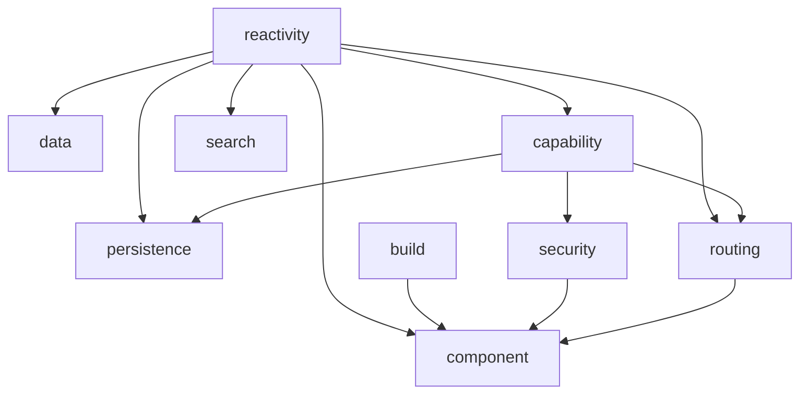

# 00 — System Map

The nine systems that make up the platform, what each owns, what each does not, and how they depend on each other.

This is the entry-point doc for the platform. Every other doc — system charters, interface contracts, test strategy, the writeup — sits underneath this map.

---

## The nine systems

| # | System | Owns | Does not own | Depends on | Status |
|---|--------|------|--------------|------------|--------|
| 1 | **reactivity** | Time-indexed reactive primitives (`state`/`watch`/`derived`/`untrack`/`batch`/`flush`/`resource`/`history`), the dependency graph, scheduling, motion sub-module | Rendering, persistence, capability scoping at runtime | (none — foundational) | shipped v0.1 |
| 2 | **component** | Component model, SSR + hydration (page/serve/boot/app), islands (the only hydration model), per-route bundle splitting, dev supervisor, theme/typography/viewport/copy app-DX primitives, typed metadata, security headers + per-response CSP nonce, Tailwind v4 integration, `discoverPages()` | Reactivity primitives, data fetching, route DSL (uses routing's matcher), storage | reactivity, capability, routing, security | shipped v0.1 (post-Tier 13) |
| 3 | **data** | One helper: `collection<T>()` over `State<T[]>` with CRUD methods | Queries, mutations, loaders, source-of-truth abstraction (all deferred — see system charter) | reactivity | shipped v0.1 (scoped) |
| 4 | **routing** | URL ↔ state mapping (`Router`, `RouterCap`), router factories (`pathRouter`/`hashRouter`/`memoryRouter`/`serverRouter`), `<Link>`, typed route schemas (`route()`, `searchParams()`, `routes()`), `parsePath`, the `place:nav` SPA-nav event | Components (consumer), data, scroll restoration (component owns `__spa_nav`) | reactivity, capability, component | shipped v0.1 |
| 5 | **persistence** | Storage adapters (`localStorage` / `indexedDB` / `server` (HTTP + WS) / `memory` / `crossTab(inner)`), `persistedState(adapter)`, durability semantics | Reactivity primitives, schema definition | reactivity, capability | shipped v0.1 |
| 6 | **search** | One helper: `searchable(items)` — in-process indexer with substring + structured queries | Storage transport, embeddings backend | reactivity | shipped v0.1 (scoped) |
| 7 | **capability** | `defineCapability` / `cap` / `provide` / `install` / `use` / `tryUse` / `requires` / `Provision`, per-request ALS scope (`runWithCapabilityScope`), `ClientOnlyAbort`, effect-kind brand types | Runtime reactivity (consumes it), components (consumes it) | reactivity | shipped v0.1 |
| 8 | **security** | `signedToken` (HMAC-SHA256) / `csrfToken` (double-submit) / `rateLimit` (token bucket) / `SessionCap` + `requireSession` / cookie helpers (secure by default) / `CSP_DEFAULTS` + `cspHeader` | Login flows, OAuth, password hashing, the SQL layer | capability | shipped v0.1 |
| 9 | **build** | Bundler integration (`Bun.build` plus per-route splitting), `discoverIslands`, view classifier, island bundler, copy-runtime emission, SRI hashing, dev supervisor + file watcher | Runtime behavior of any other system | (foundational with reactivity) | shipped v0.1 |

**Removed from the map:** the original `cache` system (v0.2 slot) is deferred indefinitely per `systems/cache/README.md`. The framework's internal `CacheStore` (used by ISR + image optimizer) lives inside `@place-ts/component`'s `cache.ts` as implementation detail; it is not a public-API system. The earlier "9 + cache" → now "9 with security promoted" rebalance keeps the count at nine.

---

## Coherence: what makes this a platform, not nine libraries

Three shared commitments cut across every system:

1. **Time is the primitive.** Every system that holds state holds time-indexed state. Persistence is "state at past time indices made durable." Cache is "state at the current time index, but not yet recomputed." Routing is "URL state at a time index." There is one timeline.

2. **Derivation is primary.** No system has a separate notion of "raw state vs computed state." Everything is derivation. Storage is a degenerate derivation (zero inputs, persistent cache). A query result is a derivation. A route is a derivation. A render is a derivation.

3. **The graph is the artefact.** Every system's state is part of one inspectable, serializable, fork-able graph. There is no hidden internal state in any system. Dev tools see the whole platform as one structure.

These three commitments are non-negotiable. Any system design that violates them gets pushed back to the drawing board.

---

## What's deliberately not on the map

- **Standalone state management** (Redux, Zustand, etc. shape) — collapses into reactivity.
- **Standalone form library** — composes from data + component + reactivity.
- **Standalone animation library** — *shipped as a sub-module of reactivity*: `@place-ts/reactivity/motion` (spring / tween / sequence / curve). Motion is interpolated derived state over time — the same primitive everything else reactive composes from. No new top-level system. See [ADR 0015](../decisions/0015-motion-as-reactivity-submodule.md).
- **CSS / styling system** — we don't ship a styling solution; the component system pipes Tailwind v4 through as a first-class option (`serve({ tailwind: true })`) and `page.styles` accepts arbitrary stylesheet sources.
- **Component library** — `@place-ts/design` is a *curated package*, not a 10th system. It is shipped alongside the platform (Button, Field, Dialog, Toast, Tooltip, Menu, Avatar, Badge, Card) and built on top of the component system's `recipe()` + `themeTokens()` + Tailwind v4 base. Apps import from `@place-ts/design`; the platform map keeps 9 systems. See [ADR 0016](../decisions/0016-design-library-as-package.md).
- **Canvas / scene-graph system** — *charter written but deferred*: trigger is the reactive-graph devtool (charter clause 3, "the graph is observable"). The design (reactive scene graph, SVG SSR fallback, WebGL promote) is locked in via [ADR 0017](../decisions/0017-canvas-deferred-pending-devtool.md); no code until the trigger fires.

### What changed in v0.3: server framework is in scope

The original system map called server framework out as "not on the map — this is a client-first platform." That changed when the component system grew the SSR layer. The shift is intentional, narrow, and bounded:

- The server framework lives **inside** the component system as `serve()` / `page()` / `boot()`. There is no separate `@place-ts/server` package.
- Persistence is still a peer of other backends; `serve()` does not own data or state. It dispatches HTTP, renders pages, serves the client bundle, and applies security headers.
- Local-first remains the default. SSR is the page-load entry; persistence + reactivity own everything after first paint.

The server framework is opinionated-but-explicit: routes are values (not files), pages are objects (not magic exports), server-only adornments are spread structurally (no `'use client'` markers). See [ADR 0003](../decisions/0003-page-as-data-and-the-server-framework.md).

---

## Dependency graph (Mermaid)

`reactivity` is the foundation. `capability` sits one layer up — it
is what `routing`/`persistence`/`security` use to declare and consume
their typed effect slots. `component` is the integration point that
imports from every other system; in particular, it consumes
`security`'s primitives to wire the per-request CSP nonce + auto-
CSRF + secure-cookie defaults that ship with `security: 'standard'`.

---

## What changed in the reframe

The original two design docs treated reactivity as if it stood alone. The map redistributes:
- **Direction D** (reactivity-as-persistence) → split: reactivity exposes a persistence-adapter contract; persistence is its own system.
- **Direction E** (capability-passed scopes) → split: reactivity supports scoped tracking as a non-default mode; capability is its own system that uses it.

See [04-interfaces.md](04-interfaces.md) for the contract shape.
